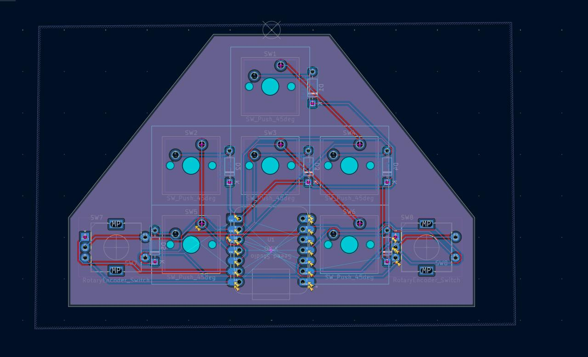
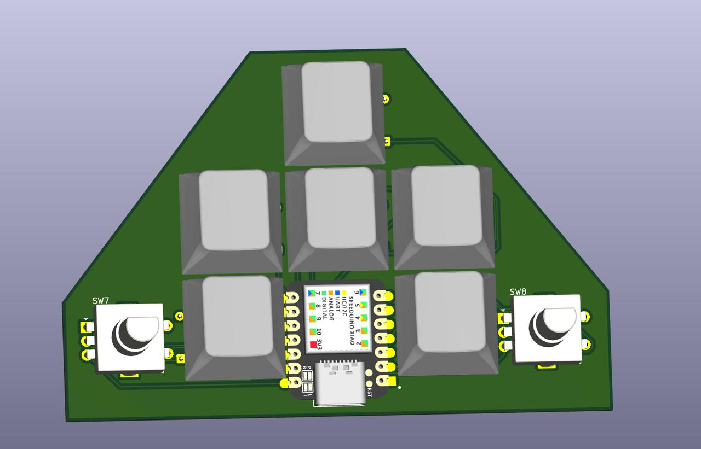
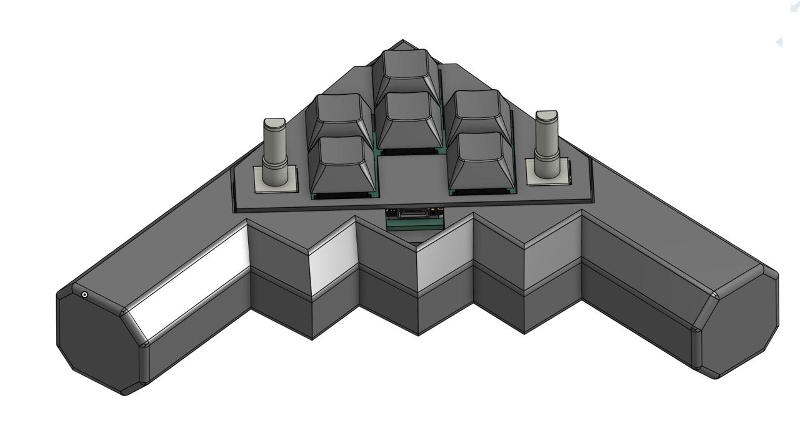
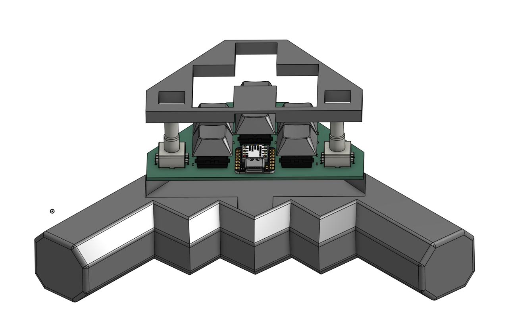

B2 BomboPad is a custom six-key macropad with two rotary encoders, designed and built from scratch.

Its angular PCB and enclosure are inspired by the silhouette of the B-2 Spirit stealth bomber. The design combines a functional macropad with an aircraft-inspired industrial aesthetic.

## Features

- 6 mechanical keys
- 2 rotary encoders with push switches
- Seeed Studio XIAO RP2040 microcontroller
- 2 × 3 diode key matrix
- Custom PCB designed in KiCad
- Custom top and bottom enclosure designed in Onshape
- QMK firmware
- Gerber files included for PCB fabrication

## Key Layout

```text
        W

     A  S  D

       ↑  ↓
```

## Bills of Materials

- 1x Seeed XIAO RP2040
- 6x MX-Style Switches
- 6x White Blank DSA keycaps
- 6x through hole 1N4148 Diodes
- 2x EC11E Rotary Encoders

##Images

#PCB




#CAD



